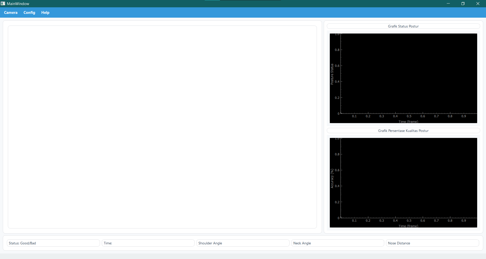

# POSREVICE

## Real-Time Computer Vision-Based Posture Monitoring System

POSREVICE is a real-time posture monitoring system designed to help users maintain proper sitting posture while working or studying. The system utilizes computer vision and MediaPipe Pose Estimation to detect and analyze the user's sitting posture through a laptop's internal camera or an external USB camera.

The application features a personalized calibration process that establishes the user's optimal posture as a reference baseline. During monitoring, the system continuously compares the user's current posture with the calibrated reference and provides feedback when significant posture deviations are detected.

---

## Overview

Poor sitting posture during prolonged activities such as working or studying may negatively affect comfort and ergonomics. POSREVICE was developed as a computer vision-based solution for monitoring sitting posture in real time without requiring wearable sensors or specialized hardware.

The system processes camera input locally on the user's computer, allowing posture monitoring to operate without requiring an internet connection.

### Key Features

* Real-time posture monitoring using an internal laptop camera or external USB camera.
* Human pose estimation using MediaPipe.
* Personalized posture calibration based on the user's optimal sitting posture.
* Real-time posture assessment based on the calibrated reference.
* Posture quality evaluation and visualization.
* Audio alerts and pop-up notifications for posture feedback.
* Customizable notification and feedback settings.
* Interactive desktop graphical user interface.
* Real-time posture-related data visualization.
* Fully offline operation without requiring an internet connection.

---

## Application Interface
Below is the main interface of POSREVICE.




---

## Technologies and Tools

### Programming Language

* Python

### Computer Vision and Pose Estimation

* MediaPipe
* OpenCV

### Desktop Application Development

* PyQt5
* Qt Designer

### Data Processing and Visualization

* NumPy
* PyQtGraph

### Audio Feedback

* Pygame

### Development Tools

* Visual Studio Code
* Git
* GitHub

---

## System Workflow

POSREVICE follows the general workflow below:

```text
Camera Input
     |
     v
Image Processing
     |
     v
MediaPipe Pose Estimation
     |
     v
Body Landmark Detection
     |
     v
Posture Analysis
     |
     v
Comparison with Calibrated Reference
     |
     +-------------------+
     |                   |
     v                   v
Proper Posture    Posture Deviation
                        |
                        v
                 Feedback System
                        |
          +-------------+-------------+
          |             |             |
          v             v             v
     Audio Alert    Pop-up Alert   Visual Feedback
```

---

## Personalized Posture Calibration

One of the main features of POSREVICE is its personalized posture calibration system.

Before starting posture monitoring, users perform a calibration process while maintaining their optimal sitting posture. The system then uses this posture as a personalized reference for future monitoring.

During real-time monitoring, the user's current posture is continuously compared with the calibrated reference to determine whether the posture remains within an acceptable range.

```text
User Calibration
       |
       v
Optimal Sitting Posture
       |
       v
Body Landmark Detection
       |
       v
Reference Posture Generation
       |
       v
Real-Time Monitoring
       |
       v
Current Posture Analysis
       |
       v
Comparison with Reference
       |
       v
Posture Assessment
```

This personalized approach allows the system to adapt to individual users rather than relying solely on a single predefined posture reference.

---

## Real-Time Posture Monitoring

During monitoring, POSREVICE continuously performs the following processes:

1. Captures video frames from the selected camera.
2. Processes the camera input using OpenCV.
3. Detects human body landmarks using MediaPipe Pose.
4. Extracts relevant posture information.
5. Analyzes the user's current sitting posture.
6. Compares the current posture with the calibrated reference.
7. Calculates posture status and quality information.
8. Displays monitoring results through the graphical user interface.
9. Provides feedback when significant posture deviations are detected.

---

## Feedback System

POSREVICE provides multiple feedback mechanisms to notify users when their posture deviates from the calibrated reference.

Available feedback mechanisms include:

* Audio alerts
* Pop-up notifications
* Visual posture status

The system allows users to customize feedback preferences according to their needs, including muting alerts or switching between available notification modes.

Audio feedback is supported using Pygame, while visual notifications are integrated into the desktop application interface.

---

## User Interface

POSREVICE provides an interactive desktop application developed using PyQt5.

The interface provides functionality for:

* Camera selection
* Camera preview
* Personalized posture calibration
* Real-time posture monitoring
* Posture status visualization
* Posture quality information
* Notification settings
* Audio feedback control
* Real-time data visualization

PyQtGraph is utilized to support efficient visualization of posture-related data within the application.

---

## Requirements

The project uses the following Python dependencies:

| Library   |   Version | Purpose                           |
| --------- | --------: | --------------------------------- |
| PyQt5     |   5.15.11 | Desktop graphical user interface  |
| OpenCV    | 4.10.0.84 | Camera input and image processing |
| NumPy     |    1.26.4 | Numerical computation             |
| MediaPipe |   0.10.21 | Human pose estimation             |
| Pygame    |     2.6.1 | Audio feedback                    |
| PyQtGraph |    0.13.7 | Real-time data visualization      |

All dependencies are listed in:

```text
requirements.txt
```

---

## Installation

### 1. Clone the Repository

```bash
git clone https://github.com/lyca-byte/posture-corrector.git
```

### 2. Navigate to the Project Directory

```bash
cd posture-corrector
```

### 3. Create a Virtual Environment

Creating a virtual environment is recommended.

```bash
python -m venv venv
```

### 4. Activate the Virtual Environment

Windows:

```bash
venv\Scripts\activate
```

Linux or macOS:

```bash
source venv/bin/activate
```

### 5. Install Dependencies

Install all required dependencies using the provided `requirements.txt` file.

```bash
pip install -r requirements.txt
```

---

## Running the Application

After successfully installing all dependencies, navigate to the directory containing the application source code and run the main Python file.

```bash
python main.py
```

Make sure that a camera is available and accessible by the application.

POSREVICE supports:

* Laptop internal cameras
* USB-connected external cameras

---

## Project Structure

The project is organized into several modules responsible for application control, posture monitoring, graphical interface functionality, and supporting resources.

```text
posture-corrector/
|
+-- assets/
|   |
|   +-- Audio feedback resources
|   |
|   +-- Logo
|
+--main.py
|   Main application entry point
|
+--controller5.py
|  Application and system control
|
+--FIX_display7.py
|  Display and visualization functionality
|
+-- requirements.txt
|
+-- README.md
```

The project structure may vary depending on the version and development stage of the application.

---

## System Requirements

### Minimum Requirements

* Python 3.x
* Laptop or desktop computer
* Integrated webcam or USB camera
* Compatible operating system
* Required Python dependencies

### Recommended Requirements

* Modern multi-core processor
* Stable camera connection
* Adequate lighting conditions
* Python virtual environment
* Sufficient system memory for real-time processing

### Internet Connection

An internet connection is not required during normal application operation.

All posture analysis is performed locally on the user's computer.

---

## Privacy

POSREVICE is designed to process camera data locally.

The system does not require:

* Cloud processing
* Internet connectivity
* External servers
* Wearable sensors
* Specialized hardware

This local processing approach helps preserve user privacy while allowing real-time posture monitoring.

---

## Project Background

POSREVICE was developed as a Capstone Design Project in the Biomedical Engineering program.

The project combines concepts from multiple disciplines, including:

* Biomedical Engineering
* Computer Vision
* Human Pose Estimation
* Image Processing
* Human Ergonomics
* Desktop Application Development
* Graphical User Interface Development

The project demonstrates the application of computer vision technology for developing a non-contact posture monitoring system using commonly available cameras.

---

## Future Improvements

Potential future developments include:

* Machine learning-based posture classification
* Posture history and analytics
* Long-term posture monitoring
* Advanced posture visualization
* Personalized posture recommendations
* Multi-user support
* Improved cross-platform compatibility
* Integration with additional devices
* More advanced posture assessment algorithms
* Enhanced user interface and user experience

---

## License

This project is currently intended for educational and research purposes.

Please contact the repository owner for questions regarding reuse, modification, or distribution.

---

## Acknowledgments

This project utilizes several open-source technologies and libraries:

* MediaPipe
* OpenCV
* PyQt5
* NumPy
* Pygame
* PyQtGraph

---
